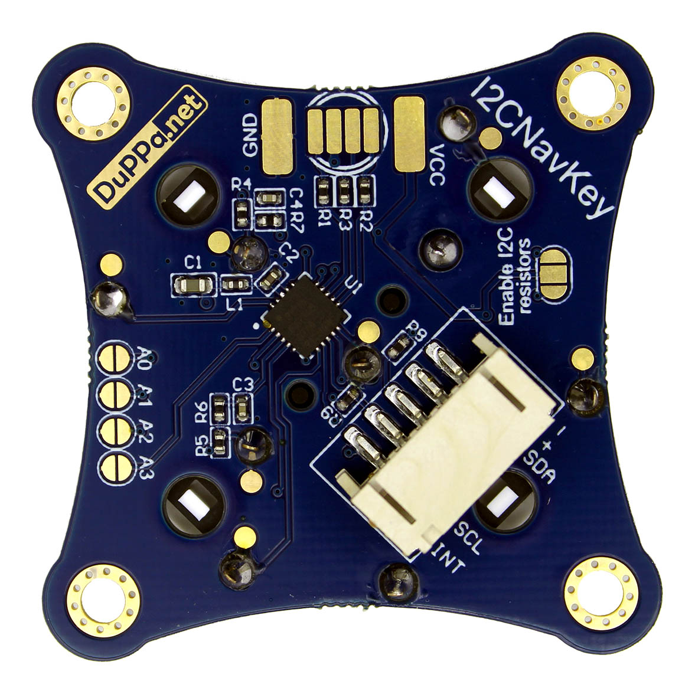
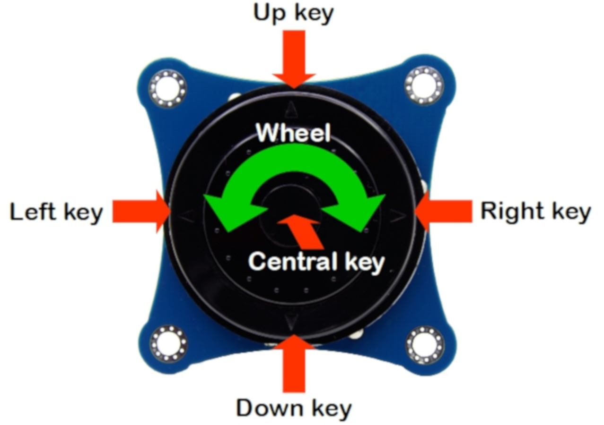

# I2C NavKey
--------------------------------------------------------------------------------

## Introduction

The I2CNavKey is a small board that includes a 7 functions joypad.
The joypad has 4 directional keys plus a central button and a rotary ring. It is controllable with the I2C bus, and it's possible to configure 16 different I2C addresses.

The I2CNavKey has also 3 configurable GPIOs with the same footprint of RGB LED. This 3 GPIOs can be configured independently in 4 different way: input, output, PWM and analog input.

Since the I2CNavKey is a I2C slave, it has a series of 8 bit registers where it's possible to configure different parameters,it's also possible to detect when the buttons are pressed or when the ring is rotated.
It also has an open-drain output pin used as interrupt output. This pin is used to notify to the master when some event happens in the I2CNavKey, the source of interrupt can be customized.

## Where you can get this board?

This project is avaiable on our [Tindie store!](https://www.tindie.com/products/16624/)

## Repository Structure
* [Arduino Library:](https://github.com/Fattoresaimon/ArduinoDuPPaLib) Repository where you can find the Arduino IDE library for the DuPPa boards
* [Firmware:](/Firmware) Project folder of Microchip MPLAB X contain the code running inside of the PIC16F18345
* [Hardware:](/Hardware) Folder containing the production file, schematic, STEP file
* [Datasheet EncoderI2C V2:](I2CNavKey_v1.0.pdf) Datasheet of the board with the description of the registers and some useful information.

**If you want to donate for my work, i would really appreciate it. You can donate here with this link. Thank you!**

